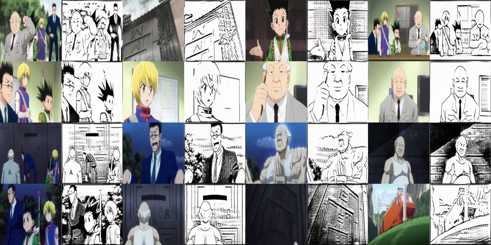
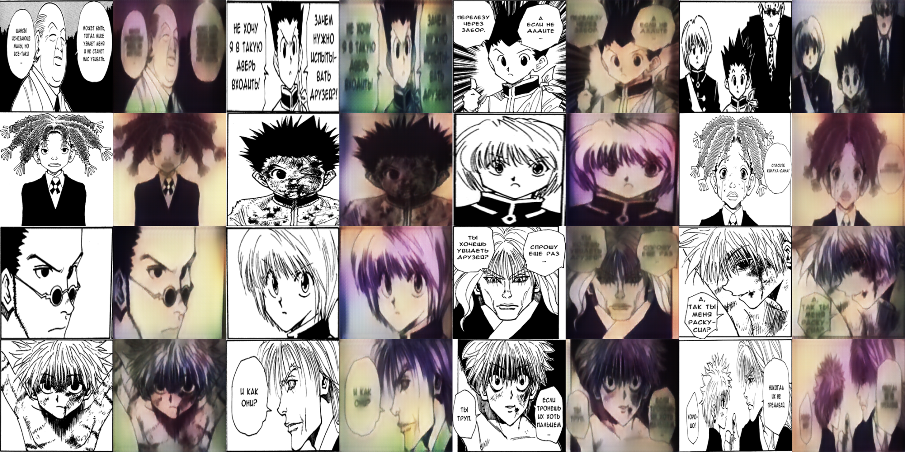

# Cycle_GAN
Постарался реадизовать архитектуру Cycle-GAN с нуля, используя фреймворк PyTorch.

## Финальная версия 
В финальной версии были использованы 2 датасета(клоны/штурмовики и дарт вейдер). Реализация представлена в файле *cyclegan_torch_final_v.ipynb*.

Веса дискриминаторов в файлах: D_A.pt, D_B.pt.

Веса генераторов не удалось загрузить в силу их большого размера.

## Изначальная версия

Изначально я выбрал задачу по раскраске манги на основе аниме-адаптации(HunterXHunter). Процесс сбора и предобработки данных занял больше всего времени. Сначала надо было выбрать томы манги и серии аниме, которые наиболее похожи по кадрам. В итоге рассматривались 5 томов манги и 4 серии аниме. 

В файле *Preprocess_mp4.ipynb* сначала загружается серия аниме, а затем на основе библиотеки cv2 производится разделение на кадры(с временным лагом в 3 секунды). В файле *Preprocess_frames.ipynb* на основе той же библиотеки были разделены страницы томов манги на фреймы.

Результат оставил желать лучшего, поэтому был выбран другой датасет. Из аниме в мангу(комикс) - результат сносный. Обратный ход - оставляет желать лучшего.

